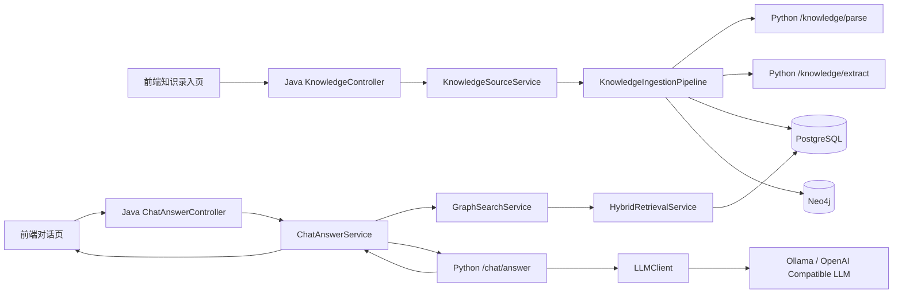
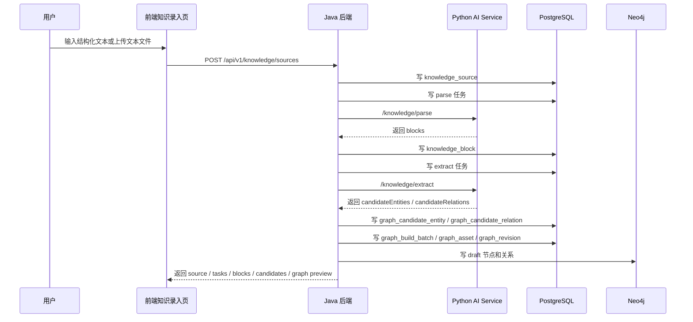
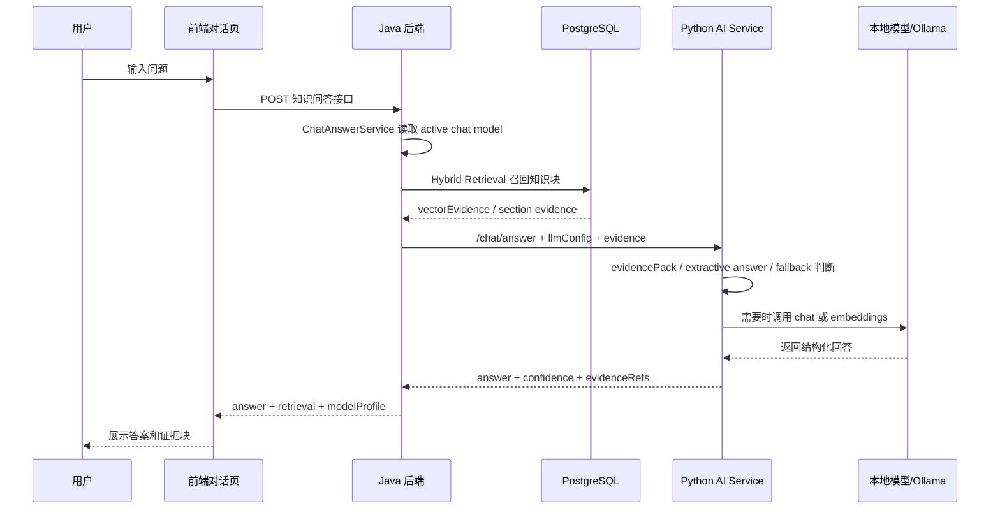

# 知识库录入与对话问答全链路分析（CodeGraph 版）

## 1. 文档目标与追踪范围

本文基于仓库内 `.codegraph/` 索引、定点源码阅读和当前建表 SQL，对系统中两条核心业务链路做完整追踪：

1. 知识库从用户输入，到解析、抽取、生成候选、写入 PostgreSQL、同步草稿到 Neo4j 的全过程。
2. 用户在对话页提问后，系统如何检索命中的知识块、如何组装证据、如何调用模型生成回答、如何将结果返回前端的全过程。

本文只描述当前主干代码中已经存在或明确预留的实现，不把尚未接线的设计能力当作已完成能力。

## 2. 技术栈与职责分工

### 2.1 前端

- Vue 3 + Vite + TypeScript + Element Plus
- 作用：管理台知识录入、图谱预览、模型配置、对话页交互
- 关键文件：
  - [frontend/package.json](../frontend/package.json)
  - [frontend/src/views/admin/AdminKnowledgeIngestView.vue](../frontend/src/views/admin/AdminKnowledgeIngestView.vue)
  - [frontend/src/views/ChatView.vue](../frontend/src/views/ChatView.vue)
  - [frontend/src/api.ts](../frontend/src/api.ts)

### 2.2 Java 后端

- Spring Boot 3.5.7 + Spring Web + Spring JDBC + PostgreSQL Driver + Neo4j Java Driver
- 作用：业务编排、数据库读写、Neo4j 写入、对 Python AI Service 的调用、前端 API 暴露
- 关键文件：
  - [backend-java/pom.xml](../backend-java/pom.xml)
  - [backend-java/src/main/java/com/company/smartsupport/knowledge/KnowledgeController.java](../backend-java/src/main/java/com/company/smartsupport/knowledge/KnowledgeController.java)
  - [backend-java/src/main/java/com/company/smartsupport/knowledge/KnowledgeIngestionPipeline.java](../backend-java/src/main/java/com/company/smartsupport/knowledge/KnowledgeIngestionPipeline.java)
  - [backend-java/src/main/java/com/company/smartsupport/chat/ChatAnswerService.java](../backend-java/src/main/java/com/company/smartsupport/chat/ChatAnswerService.java)
  - [backend-java/src/main/java/com/company/smartsupport/graph/GraphSearchService.java](../backend-java/src/main/java/com/company/smartsupport/graph/GraphSearchService.java)
  - [backend-java/src/main/java/com/company/smartsupport/integration/AiServiceClient.java](../backend-java/src/main/java/com/company/smartsupport/integration/AiServiceClient.java)

### 2.3 Python AI Service

- FastAPI + httpx
- 作用：知识解析、候选抽取、问答证据打包、模型调用网关、Embedding 和 LLM 校验
- 关键文件：
  - [ai-service-python/app/main.py](../ai-service-python/app/main.py)
  - [ai-service-python/app/clients/llm_client.py](../ai-service-python/app/clients/llm_client.py)

### 2.4 数据层

- PostgreSQL
  - 保存知识源、入库任务、知识块、候选实体、候选关系、图谱构建批次、图谱资产、图谱版本
  - 使用 pgvector 的 `vector` 列与 HNSW 索引支撑语义召回
- Neo4j
  - 保存知识图谱草稿节点和关系，状态目前以 `draft` 为主

### 2.5 MCP Server

- Node.js HTTP 服务，当前主要提供 mock 工具边界
- 在“知识录入”和“知识问答”主链路中当前没有真正参与
- 关键文件：
  - [mcp-server-node/src/index.ts](../mcp-server-node/src/index.ts)

## 3. 总体架构总览

## 4. 链路一：知识库从用户输入到入库的完整过程

## 4.1 前端入口：知识录入

知识录入入口在 [frontend/src/views/admin/AdminKnowledgeIngestView.vue](../frontend/src/views/admin/AdminKnowledgeIngestView.vue)。

用户可通过两种方式提交：

1. 结构化文本输入
2. 文本类文件上传（当前直接支持 `txt`、`md`、`csv`、`json`、`ini`、`log`、`sql`、`ddl`）

前端方法 `submitKnowledge()` 会：

1. 组装请求体
2. 调用 [frontend/src/api.ts](../frontend/src/api.ts) 中的 `createKnowledgeSource`
3. 提交到 `POST /api/v1/knowledge/sources`
4. 继续拉取任务、知识块、候选结果、图谱预览

这意味着前端不是“上传后完全异步不管”，而是提交后立即刷新解析结果和草稿图谱预览。

## 4.2 Java 接口入口

后端入口在 [backend-java/src/main/java/com/company/smartsupport/knowledge/KnowledgeController.java](../backend-java/src/main/java/com/company/smartsupport/knowledge/KnowledgeController.java)。

主入口接口：

- `POST /api/v1/knowledge/sources`
- `GET /api/v1/knowledge/sources/{sourceId}/tasks`
- `GET /api/v1/knowledge/sources/{sourceId}/blocks`
- `GET /api/v1/knowledge/sources/{sourceId}/candidates`
- `POST /api/v1/knowledge/sources/{sourceId}/retry`

真正的知识入库起点是 `createKnowledgeSource()`，它调用 `KnowledgeSourceService.createKnowledgeSource(...)`。

## 4.3 知识源落 PostgreSQL：knowledge_source

在 `KnowledgeSourceService.createKnowledgeSource(...)` 中，首先会创建知识源主记录。

主表定义见：

- [04_数据库与API/08A_建表SQL/knowledge_source.sql](../04_数据库与API/08A_建表SQL/knowledge_source.sql)

表的关键字段：

- `source_id`：知识源主键
- `project_id`：项目隔离键
- `source_type`：来源类型
- `file_name`、`raw_text`：原始内容来源
- `status`：整体状态，取值包括 `uploaded`、`parsing`、`extracted`、`graph_ready`、`published`、`failed`
- `parser_status`、`extract_status`、`graph_build_status`：分阶段状态
- `failure_reason`：失败原因

知识源创建后，Java 会立刻创建一条解析任务记录，而不是等消息队列消费。

## 4.4 任务记录：knowledge_ingestion_task

任务表定义见：

- [04_数据库与API/08A_建表SQL/knowledge_ingestion_task.sql](../04_数据库与API/08A_建表SQL/knowledge_ingestion_task.sql)

关键字段：

- `task_type`：`parse`、`ocr`、`extract`、`graph_build`、`retry`
- `status`：`pending`、`running`、`success`、`failed`、`canceled`
- `result_payload`：阶段结果
- `error_message`：阶段失败原因

当前系统虽然有任务表和任务查询接口，但执行方式仍然是同步编排，不是独立后台 worker。

## 4.5 Java 编排主干：KnowledgeIngestionPipeline

核心编排文件：

- [backend-java/src/main/java/com/company/smartsupport/knowledge/KnowledgeIngestionPipeline.java](../backend-java/src/main/java/com/company/smartsupport/knowledge/KnowledgeIngestionPipeline.java)

`run(projectId, sourceId)` 的主流程如下：

1. 读取知识源
2. 清理该知识源此前生成的衍生物
3. 更新 source 状态为 `parsing`
4. 读取图谱 taxonomy
5. 调用 Python `/knowledge/parse`
6. 将 parse 返回的 blocks 逐条写入 `knowledge_block`
7. 完成 parse 任务
8. 创建 extract 任务，更新 source 阶段状态
9. 调用 Python `/knowledge/extract`
10. 将候选实体写入 `graph_candidate_entity`
11. 将候选关系写入 `graph_candidate_relation`
12. 完成 extract 任务
13. 创建 graph_build 任务
14. 创建图谱构建批次、图谱资产、图谱版本草稿
15. 将图谱草稿写入 Neo4j
16. 完成 graph_build 任务并把 source 状态更新为 `graph_ready`

如果中途发生异常，则三类任务都会被标记失败，source 总状态切到 `failed`。

## 4.6 解析阶段：Python /knowledge/parse

Java 到 Python 的网关统一走：

- [backend-java/src/main/java/com/company/smartsupport/integration/AiServiceClient.java](../backend-java/src/main/java/com/company/smartsupport/integration/AiServiceClient.java)

解析调用路径：

1. Java `KnowledgeIngestionPipeline.run()`
2. `AiServiceClient.parseKnowledge(...)`
3. Python [ai-service-python/app/main.py](../ai-service-python/app/main.py) 中的 `/knowledge/parse`

Python 解析服务负责把原始文本切成稳定的 block 列表，用于后续抽取与检索。

返回的 block 会被 Java 逐条持久化到 `knowledge_block`。

## 4.7 知识块落库：knowledge_block

知识块主表定义见：

- [04_数据库与API/08A_建表SQL/real_kg_schema.sql](../04_数据库与API/08A_建表SQL/real_kg_schema.sql)

关键字段：

- `block_id`
- `source_id`
- `block_type`
- `section_path`
- `raw_text`
- `normalized_text`
- `content_hash`
- `metadata`
- `embedding`
- `embedding_model`
- `embedding_version`
- `embedding_dim`
- `ts`：全文检索用的 tsvector 生成列

从 schema 看，系统设计上已经为三类检索能力预留好了物理结构：

1. 全文检索：`ts`
2. 语义检索：`embedding`
3. 结构增强：`section_path`、`parent_block_id`、`metadata`

但当前主干代码的实际写入链只确认写入了 block 基础字段，尚未看到 `/knowledge/embed` 在 Java 编排里被调用，因此向量写库闭环仍未接上。

## 4.8 抽取阶段：Python /knowledge/extract

抽取调用路径：

1. Java `KnowledgeIngestionPipeline.run()` 组装 `extractRequest`
2. 通过 `AiServiceClient.extractKnowledge(...)` 调用 Python
3. Python `/knowledge/extract` 返回 `candidateEntities` 和 `candidateRelations`

抽取输入除 blocks 外，还包括：

- 图谱 taxonomy
- 是否启用 LLM 抽取
- 当前知识抽取模型配置 `llmConfig`

这说明知识入库阶段已经与模型配置体系打通，抽取模型和对话模型是分用途配置的。

## 4.9 候选实体与候选关系落库

候选实体表：

- [04_数据库与API/08A_建表SQL/real_kg_schema.sql](../04_数据库与API/08A_建表SQL/real_kg_schema.sql)

候选关系表：

- [04_数据库与API/08A_建表SQL/real_kg_schema.sql](../04_数据库与API/08A_建表SQL/real_kg_schema.sql)

关键状态值：

- `candidate`
- `accepted`
- `reviewing`
- `rejected`
- `conflict`
- `merged`
- `frozen`

Java 在当前链路中会：

1. 把候选实体写入 `graph_candidate_entity`
2. 维护 `tempId -> candidateId` 的映射
3. 再把候选关系写入 `graph_candidate_relation`

这里写入的是“候选层”，不是最终发布层。

## 4.10 图谱构建：graph_build_batch、graph_asset、graph_revision

图谱版本元数据分三层：

- 构建批次：[04_数据库与API/08A_建表SQL/graph_build_batch.sql](../04_数据库与API/08A_建表SQL/graph_build_batch.sql)
- 图谱资产：[04_数据库与API/08A_建表SQL/graph_asset.sql](../04_数据库与API/08A_建表SQL/graph_asset.sql)
- 图谱版本：[04_数据库与API/08A_建表SQL/graph_revision.sql](../04_数据库与API/08A_建表SQL/graph_revision.sql)

它们的职责分别是：

1. `graph_build_batch`：记录一次知识入图任务的批次上下文
2. `graph_asset`：记录图谱对象本身、状态、Neo4j 引用、来源、统计信息
3. `graph_revision`：记录版本号、差异摘要、发布和回滚状态

在 `KnowledgeIngestionPipeline.run()` 中，Java 调用 `knowledgeRepository.createDraftGraph(...)` 创建 draft 版本，并让 `graph_asset.active_revision_id` 指向当前草稿 revision。

## 4.11 Neo4j 草稿写入

Neo4j 写入点在：

- [backend-java/src/main/java/com/company/smartsupport/knowledge/KnowledgeIngestionPipeline.java](../backend-java/src/main/java/com/company/smartsupport/knowledge/KnowledgeIngestionPipeline.java)
- [backend-java/src/main/java/com/company/smartsupport/graph/Neo4jGraphRepository.java](../backend-java/src/main/java/com/company/smartsupport/graph/Neo4jGraphRepository.java)

`writeNeo4jDraft(...)` 会：

1. 把候选实体映射成 Neo4j `KnowledgeEntity`
2. 把候选关系映射成 Neo4j `RELATION`
3. 统一写 `status=draft`
4. 统一带上 `revisionId`
5. 带上 `sourceRefs`、`evidenceRefs`、`graphCategoryId`

因此当前链路里 Neo4j 不是“最终发布图”，而是“可预览、可编辑的草稿图”。

## 4.12 前端回看录入结果

知识源提交完成后，前端继续调用：

1. `getKnowledgeTasks`
2. `getKnowledgeBlocks`
3. `getKnowledgeCandidates`
4. `queryGraphs`
5. `getGraph`

对应页面仍然是 [frontend/src/views/admin/AdminKnowledgeIngestView.vue](../frontend/src/views/admin/AdminKnowledgeIngestView.vue)。

这意味着录入页本身同时承担了三类角色：

1. 输入入口
2. 处理中间状态查看页
3. 图谱草稿预览页

## 4.13 候选审核、冻结、发布的当前状态

从表结构和部分服务代码看，系统已经预留了候选审核、冻结、发布、回滚等能力：

- 候选状态：`candidate`、`reviewing`、`conflict` 等
- 图谱资产状态：`draft`、`reviewing`、`published`、`deprecated`、`rolled_back`
- 图谱版本状态：`draft`、`reviewing`、`published`、`deprecated`、`rolled_back`

但就当前主干代码实际链路而言，可以确认的只有：

1. 候选入库
2. 草稿图构建
3. 草稿图编辑
4. 冻结/解冻部分接口

尚未确认完整闭环的部分：

1. 候选审核转正为正式图谱对象
2. 图谱版本发布的完整实现
3. 从 candidate 到 published 的完整审核流

因此当前“知识录入 -> 数据库/Neo4j 草稿”这条链已经可用，但“审核发布闭环”仍属于未完全落地状态。

## 4.14 链路一当前缺口

当前主干代码可以明确识别出三类缺口：

1. `knowledge_block.embedding` 的写入链未接通
2. Java 主编排未实际调用 Python `/knowledge/embed`
3. 候选审核到正式发布的完整闭环未在主链中看到实现

所以链路一的真实现状应描述为：

“已经打通到知识源 -> block -> candidate -> graph draft -> Neo4j draft，但向量写库和正式发布闭环仍未完成。”

## 5. 链路二：用户提问到返回答案的完整过程

## 5.1 前端入口：ChatView

对话入口在：

- [frontend/src/views/ChatView.vue](../frontend/src/views/ChatView.vue)

前端核心方法是 `runDiagnosis()`，它会：

1. 先调用 `api.createSession(...)`
2. 再调用 `api.answerFromKnowledge(...)`
3. 将返回的 `knowledgeAnswer.answer` 直接追加到对话气泡
4. 同时在右侧展示 `evidenceRefs` 或 `retrieval.vectorEvidence`

这意味着用户看到的回答不是纯黑盒大模型输出，而是同时带有证据块展示。

## 5.2 会话创建：当前仍是占位链路

`createSession(...)` 对应的是支持会话管理的后端接口，但当前从代码职责看，这部分主要仍是会话上下文或 mock 支撑，并不参与真正的知识检索主链。

因此“创建会话”不是回答逻辑的关键检索步骤，只是问答 UI 的会话容器。

## 5.3 真正问答入口：ChatAnswerController -> ChatAnswerService

真正的知识回答主链从以下位置进入：

- [backend-java/src/main/java/com/company/smartsupport/chat/ChatAnswerController.java](../backend-java/src/main/java/com/company/smartsupport/chat/ChatAnswerController.java)
- [backend-java/src/main/java/com/company/smartsupport/chat/ChatAnswerService.java](../backend-java/src/main/java/com/company/smartsupport/chat/ChatAnswerService.java)

`ChatAnswerService.answer(...)` 的职责拆分非常清晰：

1. 校验 `questionText`
2. 读取当前项目激活的 `chat_answer` 模型配置
3. 决定 `forceGraphGrounding`
4. 组装搜索请求并交给 `GraphSearchService.searchDiagnosis(...)`
5. 将检索结果和 `llmConfig` 一并发给 Python `/chat/answer`
6. 如果 Python 不可用，则本地 fallback 返回证据摘要

## 5.4 检索编排：GraphSearchService

检索编排服务在：

- [backend-java/src/main/java/com/company/smartsupport/graph/GraphSearchService.java](../backend-java/src/main/java/com/company/smartsupport/graph/GraphSearchService.java)

它当前做了几件事：

1. 读取遍历预算 `TraversalBudget`
2. 提取关键词、queryVector、embeddingModel、embeddingVersion、limit、recencyAware
3. 调用 `HybridRetrievalService.retrieve(...)`
4. 返回统一检索结果对象

但当前真实返回值中：

- `matchedEntities = []`
- `graphPaths = []`
- `sourceEvidence = []`
- `suggestedMcpCapabilities = []`

只有 `vectorEvidence` 是真实填充的。

所以现阶段的“图谱约束”更多是回答层约束，不是基于真实 Neo4j 路径推理的完整图检索。

## 5.5 混合检索：HybridRetrievalService

核心检索服务在：

- [backend-java/src/main/java/com/company/smartsupport/graph/HybridRetrievalService.java](../backend-java/src/main/java/com/company/smartsupport/graph/HybridRetrievalService.java)

当前实现的召回通道有四路，其中三路真实生效：

1. 向量召回 `vectorRecall`
2. BM25 召回 `bm25Recall`
3. 词面兜底召回 `lexicalRecall`
4. 图谱召回 `graphFuture`，当前为空实现

计算方式为混合加权：

- vector 权重
- bm25 权重
- graph 权重
- recency 权重

此外还做了一个很关键的增强：

如果命中的最佳证据是 Markdown 标题块，会自动扩展到同一 `source_id + section_path` 下的整段章节。这让问答不是只命中一小段，而是能把一整节上下文补全回来。

## 5.6 检索实际读的数据库

检索数据主要来自 PostgreSQL `knowledge_block`。

从 schema 和 Java 仓库调用可以看出三种数据访问模式：

1. 向量检索读取 `knowledge_block.embedding`
2. BM25 检索读取 `knowledge_block.ts`
3. 结构扩展读取 `section_path`、`metadata`、`source_id`

这说明问答链的证据底座当前仍然是 PostgreSQL 的知识块表，而不是直接从 Neo4j 走路径检索。

## 5.7 一个关键现状：向量召回读路径在，但请求方常常没传 queryVector

虽然 `HybridRetrievalService` 支持向量召回，但 [backend-java/src/main/java/com/company/smartsupport/chat/ChatAnswerService.java](../backend-java/src/main/java/com/company/smartsupport/chat/ChatAnswerService.java) 当前组装的 `searchRequest` 只包含：

- `questionText`
- `keywords`
- `limit`
- `recencyAware`

没有生成 `queryVector`，也没有先调用 Python 做检索规划。

因此当前线上真实回答链更接近：

“BM25 + lexical + markdown section 扩展为主，向量召回能力已具备但未在标准问答入口中充分接线。”

## 5.8 Java 到 Python：/chat/answer

Java 侧检索完成后，会把以下数据送给 Python：

1. `questionText`
2. `forceGraphGrounding`
3. 当前激活对话模型的 `llmConfig`
4. `vectorEvidence`
5. `graphPaths`
6. `matchedEntities`

调用入口仍然通过：

- [backend-java/src/main/java/com/company/smartsupport/integration/AiServiceClient.java](../backend-java/src/main/java/com/company/smartsupport/integration/AiServiceClient.java)

## 5.9 Python 侧证据组装与回答策略

Python 问答入口在：

- [ai-service-python/app/main.py](../ai-service-python/app/main.py)

主流程在 `answer_chat(...)` 中完成，逻辑分三层：

### 第一层：证据包构建

Python 先通过 `build_answer_evidence_pack(...)` 把 `vectorEvidence` 和 `graphPaths` 组装成统一 `evidencePack`。

证据包统一字段包括：

- `blockId`
- `sourceId`
- `fileName`
- `quote`
- `score`
- `metadata`

### 第二层：抽取式直答

如果命中的证据足够直接，Python 会优先尝试：

1. `section_answer_from_evidence(...)`
2. `direct_answer_from_evidence(...)`
3. `extractive_answer_payload(...)`

这一层不一定需要 LLM 即可直接给出答案，因此是最快、最稳定的一层。

### 第三层：LLM 结构化回答

如果抽取式直答不够，就会调用 `LLMClient.chat(...)`，让模型按照严格 JSON 结构返回：

- `answer`
- `confidence`
- `evidenceRefs`
- `graphPaths`
- `missingContext`
- `cannotAnswerReason`

然后再通过 `normalize_answer_payload(...)` 统一规范化。

### 第四层：降级返回

如果 LLM 调用失败、JSON 解析失败或证据不足，则走 `fallback_evidence_answer(...)`：

1. 优先返回可抽取的章节答案
2. 否则返回证据摘要
3. 并标记 `degraded = true`

这就是用户在模型不可用或格式不满足时还能看到证据摘要的原因。

## 5.10 模型调用网关：LLMClient

模型网关在：

- [ai-service-python/app/clients/llm_client.py](../ai-service-python/app/clients/llm_client.py)

当前职责包括：

1. `/models` 校验模型存在性
2. `/embeddings` 调用 embedding 模型
3. `/chat/completions` 调用对话模型
4. 对 Ollama thinking 模型，在需要结构化 JSON 输出时切换到原生 `/api/chat` 并传 `think=false`

这层实际上把不同本地模型、OpenAI 兼容接口、Ollama 原生接口统一成了上层可调用的网关。

## 5.11 forceGraphGrounding 的真实作用

前端和后端都暴露了 `forceGraphGrounding` 开关，但结合当前实现，真实作用应区分看待：

### 已实现的作用

1. 要求回答必须基于证据
2. 没有证据时直接拒答
3. 规范回答必须带 `evidenceRefs`

### 尚未完全实现的作用

1. 基于真实 Neo4j 路径进行因果推理
2. 把 `graphPaths` 作为主要答案依据
3. 根据实体匹配结果走图谱遍历

原因是当前 `GraphSearchService.searchDiagnosis(...)` 里 `graphPaths` 仍然返回空数组。

## 5.12 响应回前端

Python 返回的回答对象会由 Java 继续补充两部分信息后回前端：

1. `retrieval`：检索过程产出的原始证据
2. `modelProfile`：当前激活模型信息

前端 [frontend/src/views/ChatView.vue](../frontend/src/views/ChatView.vue) 会将：

1. `answer` 追加到聊天消息流
2. `confidence` 显示在结果区
3. `evidenceRefs` 或 `retrieval.vectorEvidence` 展示在右侧证据栏

因此用户最终看到的是“回答 + 证据块”的组合结果，而不是只有一段自然语言回答。

## 5.13 链路二当前缺口

当前问答链仍有四个明显缺口：

1. `graphPaths` 检索为空，图谱路径推理未真正接入
2. `matchedEntities` 为空，实体识别到图遍历的桥梁未接上
3. 前端标准问答入口未自动生成 `queryVector`
4. Python 暴露了 `graphs/retrieve-plan`，但 Java 主链未接线调用

所以链路二的真实现状应描述为：

“已经打通到用户提问 -> PostgreSQL 知识块混合召回 -> Python 证据组装 -> 模型回答/降级返回，但真正的图谱路径检索仍未接入主链。”

## 6. 数据库对象与职责总表

| 层级 | 表 / 存储 | 作用 | 当前状态 |
| --- | --- | --- | --- |
| 源数据 | `knowledge_source` | 保存知识源原文、状态、来源信息 | 已使用 |
| 任务 | `knowledge_ingestion_task` | 保存 parse/extract/graph_build 阶段任务 | 已使用 |
| 证据块 | `knowledge_block` | 保存解析块、结构信息、全文字段、向量字段 | 已使用，但 embedding 写入未接通 |
| 候选实体 | `graph_candidate_entity` | 保存抽取出的候选实体 | 已使用 |
| 候选关系 | `graph_candidate_relation` | 保存抽取出的候选关系 | 已使用 |
| 审核 | `graph_review_task` | 候选审核流 | 表结构存在，主链未见完整使用 |
| 批次 | `graph_build_batch` | 一次图谱构建任务批次 | 已使用 |
| 图谱资产 | `graph_asset` | 图谱对象与状态元数据 | 已使用 |
| 图谱版本 | `graph_revision` | 图谱草稿、发布、回滚版本 | 已使用，发布闭环未完全确认 |
| 图数据库 | Neo4j | 保存草稿节点和关系 | 已使用 |

## 7. 两条链路的时序概览

### 7.1 知识录入链路时序

### 7.2 对话问答链路时序

## 8. 现状总结

### 8.1 已经打通的部分

1. 知识录入页到 Java 后端的提交链
2. Java 到 Python 的 parse/extract 调用
3. `knowledge_source`、`knowledge_ingestion_task`、`knowledge_block`、候选实体关系表的写入
4. 图谱草稿元数据写入 PostgreSQL
5. 图谱草稿节点关系写入 Neo4j
6. 对话页到 Java 问答接口的调用
7. PostgreSQL 证据块混合召回
8. Python 证据包组装与回答生成
9. LLM 不可用时的降级证据摘要机制

### 8.2 已预留但未完整打通的部分

1. `/knowledge/embed` 编排接线
2. `knowledge_block.embedding` 的真实写库闭环
3. graph path 检索
4. 实体匹配与图遍历
5. 检索规划 `graphs/retrieve-plan` 到主问答链的接线
6. candidate 到 published 的完整审核发布闭环

## 9. 对研发和排查的直接结论

### 9.1 如果要排查“为什么录入后搜不到”

优先检查：

1. `knowledge_source` 状态是否停在 `failed`
2. `knowledge_ingestion_task` 是否在 parse/extract/graph_build 某阶段失败
3. `knowledge_block` 是否已写入
4. 抽取结果是否落到了候选表
5. 当前问答链是否只走了 BM25，而目标内容需要 embedding 才能命中

### 9.2 如果要排查“为什么强制图谱回答却没有图谱路径”

优先检查：

1. `GraphSearchService.searchDiagnosis(...)` 是否仍返回空 `graphPaths`
2. Java 是否仍未调用 `graphs/retrieve-plan`
3. 实体识别和图遍历是否未接线

### 9.3 如果要补全链路

建议优先级：

1. 先补 `/knowledge/embed` 到 `knowledge_block.embedding` 的写库闭环
2. 再补 query vector 生成和问答入口向量检索接线
3. 再补 graph path 检索和 `matchedEntities/graphPaths` 真实填充
4. 最后补候选审核发布闭环

## 10. 一句话结论

当前系统已经具备“知识输入 -> 解析抽取 -> PostgreSQL/Neo4j 草稿入库 -> 对话检索 -> 证据回答”的主干能力，但它的真实落点仍以 PostgreSQL 的知识块检索为主，Neo4j 目前更多承担草稿图承载与后续治理基础；向量写库、图谱路径检索、候选审核发布仍是链路上尚未完全闭环的三段关键缺口。