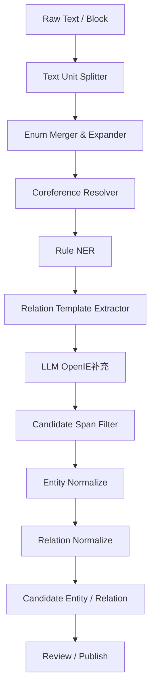

# 知识抽取 PreProcess 层评估与设计

## 1. 结论

当前问题不是模型完全不会抽取，而是知识抽取链路缺少一个成体系的 **PreProcess Layer（预处理层）**。

更准确地说：系统现在已经有部分规则抽取能力，但它们分散在 `extract_generic_facts`、`extract_key_value_facts`、`extract_enumerated_component_facts` 和 OpenIE Prompt 中，尚未形成“先切句、再展开、再归一、再抽取、再过滤”的稳定流水线。

因此用户样例中：

```text
张华管理先科制药有限公司，
公司下有五个部门：
财务、销售、研发、质检、售后。
张华毕业于南京理工大学金融管理系硕士学位
```

当前系统容易得到错误候选：

```text
实体：公司下有五个部门
关系：公司下有五个部门 -> 财务
```

这不是单纯调大模型或换模型能稳定解决的问题。正确方向是：

```text
Raw Block
↓
PreProcess Layer
  - Sentence Split
  - Clause Split
  - Enum Expand
  - Coreference Resolve
  - Candidate Span Filter
↓
NER / Rule Extract / LLM OpenIE
↓
Normalize
↓
Relation Extract
↓
Candidate Graph
↓
Review / Publish
```

## 2. 当前代码现状

### 2.1 当前抽取入口

当前抽取入口集中在：

- [ai-service-python/app/main.py](../ai-service-python/app/main.py)

核心函数：

- `extract_candidates(request)`
- `extract_generic_facts(...)`
- `extract_enumerated_component_facts(...)`
- `extract_key_value_facts(...)`
- `extract_openie_with_llm(...)`
- `openie_prompt(...)`
- `apply_openie_payload(...)`

Java 侧不做实体语义处理，只负责把 Python 返回的候选落库：

- [backend-java/src/main/java/com/company/smartsupport/knowledge/KnowledgeIngestionPipeline.java](../backend-java/src/main/java/com/company/smartsupport/knowledge/KnowledgeIngestionPipeline.java)

其中 Java 会读取：

```java
candidateEntities = extractResponse.get("candidateEntities")
candidateRelations = extractResponse.get("candidateRelations")
```

然后写入：

- `graph_candidate_entity`
- `graph_candidate_relation`

这说明候选质量的主要责任在 Python AI Service。

### 2.2 当前已经有的能力

当前代码不是完全没有规则层，已经存在这些能力：

| 能力 | 当前实现 | 局限 |
| --- | --- | --- |
| 行级实体抽取 | `extract_entities_from_lines` | 只识别 `EntityType: name` 形式 |
| taxonomy 正则规则 | `extract_entities_from_rules` | 依赖提前配置规则 |
| SQL DDL 抽取 | `extract_sql_ddl_facts` | 仅针对 SQL 表结构 |
| 泛化事实抽取 | `extract_generic_facts` | 规则较粗，容易误把描述短语当实体 |
| 枚举组件抽取 | `extract_enumerated_component_facts` | 目前主要识别“覆盖/包含”，不覆盖“有 N 个部门：...” |
| key-value 抽取 | `extract_key_value_facts` | 会把“公司下有五个部门：财务...”当作 key/value |
| LLM OpenIE | `extract_openie_with_llm` | Prompt 约束不够细，且输入粒度仍然偏 block |
| Normalize API | `/knowledge/normalize` | 当前只是占位/评分雏形，没有真正接进主抽取链 |

## 3. 样例验证结果

使用用户提供的样例，在不启用 LLM 的情况下直接调用当前 Python `/knowledge/extract`，得到的关键结果为：

```json
{
  "entities": [
    {
      "type": "ExtractedObject",
      "name": "公司下有五个部门",
      "extractor": "rule",
      "props": {
        "mentionRole": "enumerationKey"
      }
    },
    {
      "type": "ExtractedObject",
      "name": "财务",
      "extractor": "rule",
      "props": {
        "mentionRole": "enumerationValue"
      }
    }
  ],
  "relations": [
    {
      "type": "HAS_VALUE",
      "source": "公司下有五个部门",
      "target": "财务"
    }
  ]
}
```

这个结果证明：

1. 当前 key-value 规则错误吞掉了枚举声明句。
2. 当前枚举规则没有识别“公司下有五个部门：财务、销售、研发、质检、售后”。
3. 当前系统没有把“公司”解析回前文“先科制药有限公司”。
4. 当前候选过滤没有拒绝“公司下有五个部门”这类描述性短语。

## 4. 根因分析

### 4.1 Chunk / Block 粒度不是唯一问题，但确实是第一层问题

当前 `build_blocks(...)` 对普通 text 的处理是按非空行切 block，而不是按句法、从句、枚举结构切 semantic unit。

这会造成两个问题：

1. 如果输入本身是一整段，模型或规则面对的是多个事实混在一个 block 里。
2. 如果输入被切成多行，则“公司下有五个部门”和“财务、销售、研发...”会被切断，反而丢掉枚举上下文。

所以不是简单地“切得越细越好”，而是要切成有结构的 `TextUnit`：

```text
SentenceUnit
EnumDeclarationUnit
EnumItemsUnit
EducationUnit
ManagementUnit
```

### 4.2 缺少枚举展开层

当前有 `extract_enumerated_component_facts(...)`，但只覆盖：

```text
X 包含 A、B、C
X 覆盖 A、B、C
```

用户样例属于另一类：

```text
X 下有 N 个部门：
A、B、C、D、E
```

这里至少需要处理：

1. owner 解析：`公司` -> `先科制药有限公司`
2. category 解析：`部门` -> Department
3. item split：`财务、销售、研发、质检、售后` -> 5 个枚举项
4. relation expand：生成 5 条 `HAS_DEPARTMENT`

### 4.3 缺少指代消解

`公司下有五个部门` 中的“公司”不是实体，它是指代词或泛称。它应该指向前文最近出现的 Company 实体：

```text
先科制药有限公司
```

没有 Coreference Resolve，就会出现：

```text
公司下有五个部门
```

被当成实体。

### 4.4 缺少描述性短语过滤

当前 `add_entity(...)` 只做 `normalize_text` 和 key 去重，没有实体候选质量门禁。

应在进入 candidate 前过滤：

```text
公司下有五个部门
包含以下内容
共有三个模块
位于某某位置
用于某某用途
```

这些通常是事实描述、关系触发句、数量描述，不应该作为实体本身。

### 4.5 Prompt 粒度和约束不足

当前 `openie_prompt(...)` 是平台中立抽取 Prompt，只限定了：

```text
ExtractedObject
ExtractedIdentifier
ExtractedQuantity
```

它没有明确禁止描述性短语，也没有明确要求：

1. 枚举必须展开
2. 关系触发词不能作为实体
3. `公司/该公司/本公司` 必须尽量回指最近组织实体
4. 学历句要拆成学校、专业、学位

因此即使 LLM 能力足够，输出稳定性也会偏低。

## 5. 目标抽取结果

针对用户样例，理想候选应为：

### 5.1 实体

| 类型 | 名称 |
| --- | --- |
| Person | 张华 |
| Company | 先科制药有限公司 |
| Department | 财务 |
| Department | 销售 |
| Department | 研发 |
| Department | 质检 |
| Department | 售后 |
| University | 南京理工大学 |
| Major | 金融管理 |
| Degree | 硕士 |

### 5.2 关系

| Source | Relation | Target |
| --- | --- | --- |
| 张华 | MANAGE | 先科制药有限公司 |
| 先科制药有限公司 | HAS_DEPARTMENT | 财务 |
| 先科制药有限公司 | HAS_DEPARTMENT | 销售 |
| 先科制药有限公司 | HAS_DEPARTMENT | 研发 |
| 先科制药有限公司 | HAS_DEPARTMENT | 质检 |
| 先科制药有限公司 | HAS_DEPARTMENT | 售后 |
| 张华 | GRADUATED_FROM | 南京理工大学 |
| 张华 | MAJOR | 金融管理 |
| 张华 | DEGREE | 硕士 |

如果当前 taxonomy 仍然只允许平台通用类型，也至少应该抽成：

```text
ExtractedObject: 张华
ExtractedObject: 先科制药有限公司
ExtractedObject: 财务
ExtractedObject: 销售
ExtractedObject: 研发
ExtractedObject: 质检
ExtractedObject: 售后
ExtractedObject: 南京理工大学
ExtractedObject: 金融管理
ExtractedObject: 硕士
```

并在 properties 中写入：

```json
{
  "semanticType": "Person|Company|Department|University|Major|Degree"
}
```

## 6. 建议新增 PreProcess Layer

### 6.1 新层职责

PreProcess Layer 不负责最终入库，也不负责最终审核，它只负责把原始 block 转成更适合抽取的结构化文本单元。

建议输出统一结构：

```json
{
  "units": [
    {
      "unitId": "u1",
      "blockId": "b1",
      "unitType": "sentence|enum_declaration|enum_items|fact_clause",
      "text": "张华管理先科制药有限公司",
      "normalizedText": "张华管理先科制药有限公司",
      "subjectHint": "张华",
      "objectHint": "先科制药有限公司",
      "semanticHints": ["management"],
      "sourceSpan": {"start": 0, "end": 13}
    }
  ],
  "context": {
    "recentEntities": [],
    "aliases": {}
  }
}
```

### 6.2 新链路位置

建议放在 Python AI Service 内部，位于 `/knowledge/parse` 和 `/knowledge/extract` 之间：

```text
Java KnowledgeIngestionPipeline
↓
Python /knowledge/parse
↓
block_envelope
↓
PreProcess Layer
↓
TextUnit list
↓
Rule Extract + LLM OpenIE
↓
Normalize / Filter
↓
candidateEntities / candidateRelations
```

短期可以不新增 HTTP 接口，直接在 `extract_candidates(...)` 内部调用：

```python
units = preprocess_block(block)
for unit in units:
    extract_unit_facts(unit, ...)
```

中期建议拆出独立模块：

```text
ai-service-python/app/preprocess/text_units.py
ai-service-python/app/preprocess/enum_expand.py
ai-service-python/app/preprocess/entity_filter.py
ai-service-python/app/preprocess/coreference.py
```

## 7. PreProcess Layer 详细设计

### 7.1 Sentence Split

目标：把 block 切成最小事实句，不把多种事实混在一起。

规则：

1. 按 `。；;!?！？` 切句。
2. 中文逗号不一律切，只有命中事实触发词时再切 clause。
3. 保留原 blockId、行号、span，确保证据可回溯。

示例：

```text
张华管理先科制药有限公司，
公司下有五个部门：
财务、销售、研发、质检、售后。
张华毕业于南京理工大学金融管理系硕士学位
```

切成：

```text
u1 张华管理先科制药有限公司
u2 公司下有五个部门：财务、销售、研发、质检、售后
u3 张华毕业于南京理工大学金融管理系硕士学位
```

注意：`公司下有五个部门` 和枚举列表不能被切成互不关联的两个 unit，必须在预处理阶段合并成 enum unit。

### 7.2 Enum Expand

目标：把枚举声明 + 枚举项展开成多个实体和多条关系。

核心模式：

```regex
(?P<owner>.+?)(?:下|下面|旗下|包括|包含|拥有|设有|有)(?P<count>[一二三四五六七八九十两0-9]+)?个?(?P<category>部门|科室|团队|模块|系统|子项)[:：]\s*(?P<items>.+)
```

对用户样例：

```text
owner = 公司
category = 部门
items = 财务、销售、研发、质检、售后
```

展开为：

```text
财务
销售
研发
质检
售后
```

关系类型映射：

| category | relation |
| --- | --- |
| 部门 / 科室 / 团队 | HAS_DEPARTMENT |
| 模块 / 功能 | HAS_MODULE |
| 子系统 / 系统 | HAS_SUBSYSTEM |
| 子项 / 组成 | HAS_COMPONENT |

如果 taxonomy 中没有这些关系类型，则降级为当前通用关系：

```text
HAS_COMPONENT
```

但 properties 要记录：

```json
{
  "semanticRelation": "HAS_DEPARTMENT",
  "category": "部门",
  "sourceRule": "enum_expand"
}
```

### 7.3 Coreference Resolve

目标：把“公司 / 该公司 / 本公司 / 其 / 他 / 她 / 该人”解析为上下文最近实体。

短期规则：

| 指代词 | 回指目标 |
| --- | --- |
| 公司 / 该公司 / 本公司 | 最近 Company / Org / 以“有限公司、公司、集团、厂”结尾的实体 |
| 学校 / 该校 | 最近 University / School |
| 他 / 她 / 该人员 | 最近 Person |
| 部门 / 该部门 | 最近 Department |

用户样例中：

```text
公司 -> 先科制药有限公司
```

这里不建议一开始做复杂神经指代模型，先用 deterministic context window 即可。

### 7.4 Domain NER Rule

目标：先用确定性规则识别高置信实体，再交给 LLM 补充。

建议首批规则：

| 类型 | 规则示例 |
| --- | --- |
| Person | 2-4 个中文字符，出现在“管理/负责/毕业于/任职于”等触发词前 |
| Company | `[\u4e00-\u9fa5A-Za-z0-9]+(?:有限公司|公司|集团|厂)` |
| Department | 枚举项上下文 category=部门，或名称以“部/科/组/中心”结尾 |
| University | `[\u4e00-\u9fa5]+(?:大学|学院)` |
| Major | `(.+?)系|(.+?)专业` |
| Degree | `博士|硕士|本科|学士|专科` |

说明：如果项目仍保持平台中立 entity type，那么这些类型先写入 `properties.semanticType`，不要强行要求数据库新增业务实体表。

### 7.5 Candidate Span Filter

目标：阻止描述性文本进入候选实体。

建议新增黑名单/弱名单规则：

```python
DESCRIPTIVE_ENTITY_PATTERNS = [
    r"有[一二三四五六七八九十两0-9]+个",
    r"包含|包括|覆盖|组成|下有|设有",
    r"位于|用于|适合|负责|毕业于",
    r"以下|如下|分别为|列表",
]
```

拒绝条件：

```text
长度 > 6
且命中描述模式
且不是已知命名实体类型
```

对用户样例：

```text
公司下有五个部门
```

应直接 reject，不能进入 `candidateEntities`。

### 7.6 Relation Template Extract

目标：对高频事实句用模板直接生成关系，不依赖 LLM。

首批模板：

#### 管理关系

```regex
(?P<person>[\u4e00-\u9fa5]{2,4})(?:管理|负责|主管)(?P<company>.+?(?:有限公司|公司|集团|厂))
```

生成：

```text
person MANAGE company
```

#### 毕业关系

```regex
(?P<person>[\u4e00-\u9fa5]{2,4})毕业于(?P<university>.+?(?:大学|学院))(?P<major>.+?)(?:系|专业)?(?P<degree>博士|硕士|本科|学士|专科)?学位?
```

生成：

```text
person GRADUATED_FROM university
person MAJOR major
person DEGREE degree
```

#### 部门枚举关系

```text
owner HAS_DEPARTMENT department_item
```

如果 taxonomy 没有 `MANAGE`、`GRADUATED_FROM`、`MAJOR`、`DEGREE`、`HAS_DEPARTMENT`，则可以先降级到通用关系：

| 业务语义关系 | 通用关系降级 |
| --- | --- |
| MANAGE | HAS_VALUE 或 MENTIONS |
| GRADUATED_FROM | HAS_VALUE |
| MAJOR | HAS_VALUE |
| DEGREE | HAS_VALUE |
| HAS_DEPARTMENT | HAS_COMPONENT |

但必须保留 `properties.semanticRelation`，为后续 taxonomy 补齐后迁移提供依据。

## 8. Prompt 改造建议

Prompt 不应该替代 PreProcess，但要配合它。

当前 `openie_prompt(...)` 建议增强以下规则：

```json
{
  "rules": [
    "不要把描述性短语当实体，例如：公司下有五个部门、包含以下内容、共有三个模块。",
    "枚举项必须拆分成多个实体，不允许把整段枚举作为一个实体。",
    "关系触发词不是实体，例如：管理、毕业于、包含、有、下有。",
    "公司、该公司、本公司应尽量指代最近出现的组织实体。",
    "学历句必须拆分为学校、专业、学位。",
    "输出实体必须是稳定名词、专名或枚举项。"
  ],
  "badExamples": [
    {"entity": "公司下有五个部门", "reason": "描述性短语，不是实体"}
  ],
  "goodExamples": [
    {
      "text": "公司下有五个部门：财务、销售、研发、质检、售后",
      "entities": ["财务", "销售", "研发", "质检", "售后"],
      "relations": ["公司 HAS_DEPARTMENT 财务", "公司 HAS_DEPARTMENT 销售"]
    }
  ]
}
```

但注意：Prompt 只能降低错误率，不能承担最终质量门禁。最终还是要靠 PreProcess + Normalize + Filter。

## 9. 推荐落地路径

### P0：先修当前样例暴露的问题

目标：一周内解决 70%-80% 类似错误。

1. 新增 `split_text_units(block)`。
2. 新增 `merge_enum_declaration_with_items(units)`。
3. 新增 `extract_department_enum_facts(unit)`。
4. 新增 `resolve_owner_reference(owner, context)`。
5. 新增 `is_descriptive_entity_name(name)`，在 `add_entity(...)` 前过滤。
6. 增强 `openie_prompt(...)`，禁止描述性短语入实体。
7. 为用户样例增加回归测试。

### P1：抽象成完整 PreProcess 模块

目标：让抽取主链从 block-based 变为 unit-based。

建议模块：

```text
ai-service-python/app/preprocess/
  __init__.py
  text_unit.py
  sentence_splitter.py
  enum_expander.py
  coreference.py
  span_filter.py
  semantic_rules.py
```

`extract_candidates(...)` 改成：

```python
for block in blocks:
    units = preprocess_block(block, context)
    for unit in units:
        extract_rule_facts(unit)
        extract_llm_facts(unit)
    normalize_and_filter_candidates()
```

### P2：接入 taxonomy 驱动规则

目标：不同项目可配置实体类型、关系类型和规则，不把“部门/学历/公司”写死在平台中。

建议新增 taxonomy 配置：

```json
{
  "entityType": "Department",
  "aliases": ["部门", "科室", "团队"],
  "enumTriggers": ["下有", "设有", "包含"],
  "relationWhenEnumerated": "HAS_DEPARTMENT"
}
```

### P3：质量评估与自动回归

建立抽取质量数据集：

1. 部门枚举
2. 人员任职
3. 学历教育
4. 表格字段
5. SQL DDL
6. 模块/功能列表
7. 组织层级

指标：

| 指标 | 说明 |
| --- | --- |
| Entity Precision | 抽出的实体有多少是真的 |
| Entity Recall | 该抽出的实体漏了多少 |
| Relation Precision | 关系是否正确 |
| Relation Recall | 关系是否漏抽 |
| Bad Span Rate | 描述性短语误入实体比例 |
| Enum Expansion Rate | 枚举项展开率 |

## 10. 推荐目标架构



关键原则：

1. LLM 负责补充，不负责兜底一切。
2. 枚举展开必须规则优先。
3. 描述性短语必须在 candidate 前过滤。
4. 指代消解先做轻量规则，不必一开始上复杂模型。
5. 证据 span 必须保留，避免抽取结果无法追溯。

## 11. 和当前架构评审结论的关系

这件事和“Embedding 闭环”“Neo4j 参与推理”不是同一个层级的问题。

它属于知识入图质量的前置问题：

```text
如果实体和关系抽错，后面即使 embedding、Neo4j、Planner 都做好，也是在错误图上推理。
```

因此建议把 PreProcess Layer 作为下一阶段 P0 任务，优先级不低于 Embedding 闭环。

建议 P0 顺序调整为：

```text
1. PreProcess Layer
2. Candidate Span Filter
3. Embedding 写入闭环
4. QueryVector 接线
5. Async Worker 架构
```

## 12. 最终判断

用户指出的问题判断正确：系统确实缺一个明确的 PreProcess Layer。

当前最核心的问题不是“模型不会抽”，而是：

1. 输入给抽取器的 unit 不稳定。
2. 枚举结构没有在模型前展开。
3. 指代词没有解析。
4. 描述性短语没有过滤。
5. Prompt 没有足够负例和输出约束。
6. Normalize API 尚未真正接入主抽取链。

建议不要继续把压力放在单次 LLM OpenIE 上，而是把知识抽取链升级为：

```text
Block
↓
PreProcess
↓
Rule-first Extract
↓
LLM补充
↓
Normalize / Filter
↓
Candidate Graph
```

这样才能稳定解决“公司下有五个部门”被误识别成实体这类问题。