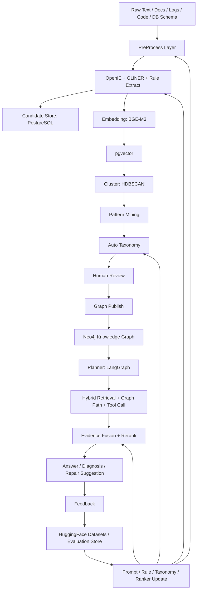

# 自进化知识图谱与 Planner 架构设计

## 1. 设计目标

本文围绕以下演进链路梳理系统架构：

```text
Raw Text
↓
OpenIE
↓
Embedding
↓
Cluster
↓
Pattern Mining
↓
Auto Taxonomy
↓
Human Review
↓
Graph
↓
Planner
↓
Feedback
↓
越来越准
```

目标不是把文本一次性抽成图，而是形成一个能持续学习的闭环：

1. 从原始文本、文档、代码、数据库、日志中自动发现实体、关系、模式和分类。
2. 通过人工审核把不稳定的 AI 输出变成可信知识。
3. 通过图谱和 Planner 支撑问答、诊断、排查、工具调用。
4. 通过用户反馈、审核反馈、命中反馈持续修正规则、Prompt、taxonomy、rerank 模型和图谱质量。

OpenIE: 是指基于文本抽取实体和关系的技术，适合从非结构化文本中发现潜在知识。
GliNER: 是指基于图神经网络的命名实体识别技术，适合在文本中识别特定类型的实体。

最终系统形态是：

```text
可审计知识生产线
+
自进化 Taxonomy
+
可解释 Graph Planner
+
反馈驱动的诊断智能体
```

## 2. 核心架构判断

这条链路本质上分三层。

### 2.1 知识生产层

负责从 Raw Text 中提取候选事实。

```text
Raw Text
↓
PreProcess
↓
OpenIE / NER / Rule Extract
↓
Candidate Entity / Candidate Relation
```

这一层追求召回率，允许产生候选，但不能直接污染正式图谱。

### 2.2 知识治理层

负责把候选事实变成可维护的知识结构。

```text
Embedding
↓
Cluster
↓
Pattern Mining
↓
Auto Taxonomy
↓
Human Review
↓
Published Graph
```

这一层追求准确率、可解释、可回滚。

### 2.3 使用与学习层

负责用图谱解决问题，并把使用结果反哺知识生产。

```text
Graph
↓
Planner
↓
Evidence Fusion
↓
Answer / Diagnosis / Tool Call
↓
Feedback
↓
Rule / Prompt / Taxonomy / Ranker Update
```

这一层决定系统是否真的“越来越准”。没有 Feedback，前面只是一次性抽取；有 Feedback，系统才会进入持续改进。

## 3. 总体架构图



## 4. 主链路分层设计

### 4.1 Raw Text 输入层

| 来源 | 示例 | 目标 |
| --- | --- | --- |
| 文档 | 需求、设计、运维、部署、FAQ、制度 | 抽取业务实体、流程、规则、约束 |
| 代码 | Controller、Service、Mapper、Vue 页面 | 抽取 API、页面、方法、调用链 |
| 数据库 | DDL、information_schema、字典表 | 抽取表、字段、枚举、约束、外键 |
| 日志 | 应用日志、任务日志、错误堆栈 | 抽取异常模式、链路、故障原因 |
| 工单 | 问题描述、处理记录、解决方案 | 抽取症状、原因、处理动作 |
| 实时系统 | MCP 工具返回结果 | 抽取当前状态与证据 |

Raw Text 不直接覆盖，只追加版本：

```text
source_id + source_version + content_hash
```

这样后续可以追溯某个实体、关系、答案、诊断建议来自哪个原文版本和哪个抽取器版本。

### 4.2 PreProcess Layer

PreProcess 是 OpenIE 前的必要层，负责把原始输入（rawText / doc / pdf / excel / png / Code / DB schema）变成稳定的、可追溯的 `TextUnit`。

整体流程：

```text
Raw Input
↓
① Format Parse（文本解析）
↓
② OCR（图片/扫描件识别）
↓
③ Layout Recover（表格恢复）
↓
④ Clean & Normalize（清洗标准化）
↓
⑤ Structure Detect（文档结构恢复）
↓
⑥ Chunk Build（文本切块）
↓
⑦ Metadata Build（元数据构建）
↓
⑧ Classification（标签分类）
↓
⑨ Entity Pre-Extract（实体预抽取）
↓
⑩ Relation Pre-Extract（关系预抽取）
↓
⑪ Summary Build（摘要生成）
↓
⑫ Embedding Build（文本转向量）
↓
⑬ Quality Check（质量检查）
↓
⑭ Storage（入库）
```

各步骤职责：

| # | 步骤 | 职责 | 说明 |
| --- | --- | --- | --- |
| 1 | **Format Parse** 文本解析 | 将 pdf / docx / excel / md / html 等格式统一解析为 raw text | 不同格式走不同 parser，输出纯文本 + 结构标记 |
| 2 | **OCR** | 对图片、扫描件进行文字识别 | 仅在输入为 png / jpg / 扫描 pdf 时触发 |
| 3 | **Layout Recover** 表格恢复 | 恢复表格、列表等二维结构 | 避免表格被拍平成无意义文本 |
| 4 | **Clean & Normalize** 清洗标准化 | 格式统一、编码统一、去除页眉页脚等噪声 | 包括全半角统一、空白归一化、特殊字符清理 |
| 5 | **Structure Detect** 文档结构恢复 | 恢复标题层级、段落边界、上下级关系 | 上游清洗可能导致结构信息丢失，此步修复 |
| 6 | **Chunk Build** 文本切块 | 将长文本切割成语义完整的小块文档 | 切块策略：① 按模块（根据一级标题，如用户模块/商品模块/销售模块）；② 按语义（如用户模块内按登录/校验/生成token/权限拆分）。子策略包括 Sentence Split、Clause Split、Enum Expand、Coreference Resolve、Noise Filter |
| 7 | **Metadata Build** 元数据构建 | 补全解析后丢失的原始文件信息 | 将 raw text 与原始 meta 信息关联，保留来源可追溯性 |
| 8 | **Classification** 标签分类 | 对 chunk 进行多标签分类，加速后续检索 | 单纯 embedding 检索会导致搜索缓慢、准确度低；多标签化可缩小检索范围、提升准确度 |
| 9 | **Entity Pre-Extract** 实体预抽取 | 从文本中识别候选实体 | 如"张华毕业于南京大学工商管理系，硕士学位。她是先科有限公司的CEO"→ 抽出：张华、南京大学、工商管理系、硕士学位、先科有限公司、CEO、2009年 |
| 10 | **Relation Pre-Extract** 关系预抽取 | 从文本中识别候选关系 | 如：张华 → 毕业于 → 南京大学；张华 → 担任 → CEO |
| 11 | **Summary Build** 摘要生成 | 为 chunk 生成摘要 | 用于快速预览和粗粒度检索 |
| 12 | **Embedding Build** 文本转向量 | 对 chunk / entity / summary 做向量化 | 使用 BGE-M3，写入 pgvector |
| 13 | **Quality Check** 质量检查 | 检查 chunk 完整性、实体覆盖率、向量质量 | 低质量数据标记为待人工复核或丢弃 |
| 14 | **Storage** 入库 | 将处理结果持久化 | 写入 PostgreSQL（chunk / metadata / embedding / candidate）和 Redis（缓存） |

Span 保留贯穿全流程，每一步输出均携带 source / block / offset 信息，便于证据回溯。

Metadata Build 输出示例：

```json
{
  "sourceId": "source-001",
  "fileName": "系统设计文档.pdf",
  "sourceType": "pdf",
  "author": "张华",
  "createdTime": "2025-03-15",
  "chunkIndex": 12,
  "sectionPath": ["系统设计", "视频模块"],
  "language": "zh",
  "domain": "construction",
  "parser": "pdf",
  "confidence": 0.94
}
```

Classification 输出示例：

```json
{
  "labels": [
    {"name": "科技", "score": 0.95},
    {"name": "AI", "score": 0.87},
    {"name": "教育", "score": 0.22}
  ]
}
```

TextUnit 输出结构（Entity/Relation Pre-Extract 后）：

```json
{
  "unitId": "u-001",
  "sourceId": "source-001",
  "blockId": "block-001",
  "chunkIndex": 12,
  "unitType": "sentence|enum|clause|table_row|code_symbol|log_event",
  "text": "张华毕业于南京大学的工商管理系，硕士学位。她是先科有限公司的CEO",
  "entities": ["张华", "南京大学", "工商管理系", "硕士学位", "先科有限公司", "CEO"],
  "relations": [
    {"subject": "张华", "predicate": "毕业于", "object": "南京大学"},
    {"subject": "张华", "predicate": "担任", "object": "CEO"}
  ],
  "labels": [{"name": "人物", "score": 0.92}, {"name": "企业", "score": 0.88}],
  "summary": "张华，南京大学工商管理硕士，先科有限公司CEO",
  "metadata": {"sectionPath": ["人物简介"], "language": "zh"},
  "span": {"start": 0, "end": 42}
}
```

#### 4.2.1 LightRAG 参考实现与吸纳计划

> 以下设计思路和实现方法来自 LightRAG 开源项目（CodeGraph 追踪），经评估后值得吸纳到本系统的 PreProcess Layer 中。每项均标注了原始代码位置，开发时可直接参考或移植。

**一、Pipeline 三阶段批处理模式**

LightRAG 将文档摄入拆为三个串行 Worker，每个 Worker 内部支持批量并发，且每一步均支持取消和断点续跑：

```text
_run_pipeline_batch (入口)
  ├── _parse_worker    → 格式解析 + OCR + 结构恢复
  ├── _analyze_worker  → 多模态分析 + 摘要生成
  └── _process_worker  → 切块 + 实体抽取 + 入图
```

**吸纳建议**：我们的 PreProcess 14 步流水线可按此三阶段分组调度，每阶段独立重试，避免单步失败导致全链重跑。

| 引用 | 文件 | 方法 |
| --- | --- | --- |
| 批处理入口 | `lightrag/pipeline.py:1166` | `_run_pipeline_batch()` |
| 解析 Worker | `lightrag/pipeline.py:1436` | `_parse_worker()` |
| 分析 Worker | `lightrag/pipeline.py:1608` | `_analyze_worker()` |
| 处理 Worker | `lightrag/pipeline.py:1716` | `_process_worker()` |
| 取消检查 | `lightrag/pipeline.py:2397` | `_cancellation_requested()` |
| 状态转换记录 | `lightrag/pipeline.py:2352` | `_upsert_doc_status_transition()` |

**二、Parser 路由决策机制**

LightRAG 不硬编码解析器，而是通过 `routing.py`（53 个符号）实现基于文件类型和配置规则的动态路由，自动分发到不同解析引擎：

```text
resolve_file_parser_directives()
  ├── native  → 原生 docx/md 解析
  ├── mineru  → MinerU 服务（pdf / 扫描件 / OCR）
  └── docling → Docling 服务（pdf / 复杂排版）
```

**吸纳建议**：我们的 ① Format Parse 应实现类似的路由层，根据 `sourceType`（pdf / docx / excel / md / html / png / code / ddl）分发到不同 parser，而不是用 if-else 判断。路由规则应可通过配置或环境变量覆盖。

| 引用 | 文件 | 方法 |
| --- | --- | --- |
| 路由决策 | `lightrag/parser/routing.py:834` | `resolve_file_parser_directives()` |
| 引擎选择 | `lightrag/parser/routing.py:819` | `resolve_file_parser_engine()` |
| 路由校验 | `lightrag/parser/routing.py:725` | `validate_parser_routing_config()` |
| 切块选项解析 | `lightrag/parser/routing.py:380` | `resolve_chunk_options()` |
| 解析选项解析 | `lightrag/parser/routing.py:143` | `parse_process_options()` |

**三、IR Builder 统一中间表示**

LightRAG 最值得借鉴的设计之一：所有解析引擎最终输出统一的 `IRDoc` 中间表示，而不是直接输出 raw text。IR 保留了标题层级、段落边界、表格结构、图片占位符等结构信息，下游切块和元数据构建都基于 IR 操作。

三套 IR Builder 共享相同输出契约：

| 引用 | 文件 | 类 |
| --- | --- | --- |
| 原生 docx IR | `lightrag/parser/docx/ir_builder.py:250` | `NativeDocxIRBuilder` |
| | `lightrag/parser/docx/ir_builder.py:261` | `.normalize()` → 输出 `IRDoc` |
| Docling IR | `lightrag/parser/external/docling/ir_builder.py:73` | `DoclingIRBuilder` |
| | `lightrag/parser/external/docling/ir_builder.py:97` | `.normalize_from_workdir()` |
| MinerU IR | `lightrag/parser/external/mineru/ir_builder.py:67` | `MinerUIRBuilder` |

**吸纳建议**：我们的 ④ Clean & Normalize 和 ⑤ Structure Detect 应定义统一的 `IRDoc` 数据结构，所有 parser 输出都转为 IR，再传入后续切块流程。这样新增 parser（如 Excel 解析、代码解析）只需实现 IR Builder 接口即可。

**四、表格 / 图片 / 公式三路结构恢复**

LightRAG 的 Layout Recover 不只处理表格，还覆盖了绘图和公式：

| 引用 | 文件 | 方法/类 |
| --- | --- | --- |
| 表格提取（含合并单元格） | `lightrag/parser/docx/table_extractor.py:160` | `TableExtractor` |
| 表格带元数据提取 | `lightrag/parser/docx/table_extractor.py:198` | `.extract_with_metadata()` |
| 图片/绘图恢复 | `lightrag/parser/docx/drawing_image_extractor.py` | `DrawingExtractionContext` |
| 图片关系加载 | `lightrag/parser/docx/drawing_image_extractor.py:194` | `load_relationships()` |
| 数学公式→LaTeX | `lightrag/parser/docx/omml/ommlparser.py:40` | `OMMLParser.parse()` |
| 编号/列表标准化 | `lightrag/parser/docx/numbering_resolver.py` | `NumberingResolver` |
| 完整 docx 结构解析 | `lightrag/parser/docx/parse_document.py` | 43 个符号 |

**吸纳建议**：我们的 ③ Layout Recover 应扩展为"结构恢复三件套"：表格恢复 + 图片占位 + 公式标准化。尤其是 `TableExtractor.extract_with_metadata()` 的合并单元格处理逻辑，直接复用可节省大量开发时间。

**五、四种切块策略 + 质量兜底**

LightRAG 提供四种切块策略，默认使用语义段落切块，并有 token 上限强制兜底：

| 策略 | 文件 | 方法 | 特点 |
| --- | --- | --- | --- |
| **段落语义切块**（默认） | `lightrag/chunker/paragraph_semantic.py:1267` | `chunking_by_paragraph_semantic()` | 按段落边界 + 语义相似度切分，保留标题层级 |
| 递归字符切块 | `lightrag/chunker/recursive_character.py:34` | `chunking_by_recursive_character()` | 按分隔符递归拆分，适合无结构文本 |
| 语义向量切块 | `lightrag/chunker/semantic_vector.py:81` | `chunking_by_semantic_vector()` | 基于 embedding 相似度断点切分 |
| 固定 token 切块 | `lightrag/chunker/token_size.py:104` | `chunking_by_fixed_token()` | 按固定 token 数切分，最简单 |
| **质量兜底** | `lightrag/utils.py:1849` | `enforce_chunk_token_limit_before_embedding()` | 切块后超长块强制截断 |

**吸纳建议**：我们的 ⑥ Chunk Build 应支持可配置的切块策略，默认使用段落语义切块。`paragraph_semantic.py`（44 个符号）是最复杂也最有价值的实现，内含表格切分、小块合并、长块拆分等子逻辑，值得整体移植。关键子方法：

| 引用 | 文件（同上） | 方法 |
| --- | --- | --- |
| 小块合并 | `lightrag/chunker/paragraph_semantic.py` | `_merge_small_blocks()` |
| 长块拆分 | `lightrag/chunker/paragraph_semantic.py` | `_split_long_block()` |
| 表格检测 | `lightrag/chunker/paragraph_semantic.py` | `_detect_table_format()` |
| 表格行拆分 | `lightrag/chunker/paragraph_semantic.py` | `_split_table_text()` |

**六、Sidecar 元数据持久化机制**

LightRAG 通过 Sidecar 文件将解析产物（block 列表、图片资产、元数据）与原始文件关联存储，实现解析结果的可追溯和增量更新：

| 引用 | 文件 | 方法 |
| --- | --- | --- |
| Sidecar 写入 | `lightrag/sidecar/writer.py:59` | `write_sidecar()` |
| Sidecar URI 生成 | `lightrag/utils_pipeline.py:500` | `sidecar_uri_for()` |
| Sidecar blocks 路径 | `lightrag/utils_pipeline.py:528` | `sidecar_blocks_path()` |
| 文档内容构建 | `lightrag/utils_pipeline.py:403` | `make_lightrag_doc_content()` |
| chunk dict 构建 | `lightrag/utils_pipeline.py:39` | `build_chunks_dict_from_chunking_result()` |
| 内容哈希 | `lightrag/utils_pipeline.py` | `compute_text_content_hash()` |

**吸纳建议**：我们的 ⑦ Metadata Build 可参考 Sidecar 模式，将 chunk 的 sectionPath、parser 版本、解析引擎、置信度等元数据独立存储，支持增量重解析时只更新变化的部分。

**七、多模态分析流程**

LightRAG 在解析和切块之间插入了一个多模态分析阶段，对图片和文本分别做摘要/描述：

| 引用 | 文件 | 方法 |
| --- | --- | --- |
| 多模态分析入口 | `lightrag/pipeline.py:3645` | `analyze_multimodal()` |
| 图片模态分析 | `lightrag/pipeline.py:3931` | `_analyze_drawing()` |
| 文本模态分析 | `lightrag/pipeline.py:4094` | `_analyze_text_modality()` |
| 上下文增强 | `lightrag/multimodal_context.py:898` | `enrich_sidecars_with_surrounding()` |
| 文档摘要 | `lightrag/utils.py:2683` | `get_content_summary()` |

**吸纳建议**：我们的 ⑪ Summary Build 可扩展为"多模态分析"阶段，不只生成文本摘要，还对图片/图表生成描述文本，作为后续 embedding 和检索的补充输入。

**八、重复检测与内容哈希**

LightRAG 在解析后立即做重复文档检测，避免重复摄入浪费算力：

| 引用 | 文件 | 方法 |
| --- | --- | --- |
| 重复检测 | `lightrag/pipeline.py:3021` | `_mark_duplicate_after_parse()` |
| 按内容哈希查重 | `lightrag/utils_pipeline.py` | `get_duplicate_doc_by_content_hash()` |
| 按文件名查重 | `lightrag/utils_pipeline.py` | `get_existing_doc_by_file_basename()` |

**吸纳建议**：我们的 ⑬ Quality Check 应在切块前增加文档级去重（content_hash），在切块后增加 chunk 级去重，避免同一份文档多次上传产生重复实体和关系。

**九、实体/关系抽取与图合并**

| 引用 | 文件 | 方法/类 |
| --- | --- | --- |
| 实体抽取入口 | `lightrag/lightrag.py:1389` | `_process_extract_entities()` |
| 抽取执行 | `lightrag/operate.py:3221` | `extract_entities()` |
| Prompt 模板解析 | `lightrag/prompt.py:847` | `resolve_entity_extraction_prompt_profile()` |
| 并发控制 | `lightrag/operate.py:3580` | `_process_with_semaphore()` |
| 图合并去重 | `lightrag/operate.py:2815` | `merge_nodes_and_edges()` |
| 实体名处理 | `lightrag/operate.py:2900` | `_locked_process_entity_name()` |
| 关系边处理 | `lightrag/operate.py:3005` | `_locked_process_edges()` |
| 实体类型定义 | `lightrag/types.py:7` | `ExtractedEntity` |
| 关系类型定义 | `lightrag/types.py:19` | `ExtractedRelationship` |

**吸纳建议**：`merge_nodes_and_edges()` 的锁机制（实体名锁 + 边锁）值得借鉴——多个 chunk 并行抽取时，同名实体和同对关系需要原子合并而非覆盖。我们的 ⑨⑩ Entity/Relation Pre-Extract 输出进入 candidate store 前应做类似的合并去重。

**十、LightRAG 缺失项（我们的差异化优势）**

以下是我们设计中有但 LightRAG 未实现的能力，属于差异化设计，应优先实现：

| 我们的步骤 | LightRAG 缺失 | 说明 |
| --- | --- | --- |
| ⑧ Classification 标签分类 | 无独立分类步骤 | LightRAG 完全依赖 embedding 检索，无标签缩小范围 |
| Candidate Store 审核流 | 无 candidate/review 机制 | LightRAG 抽取后直接入图，无人工门禁 |
| Auto Taxonomy 进化 | 无 taxonomy 自动提案 | LightRAG 使用固定 entity type |
| Feedback 闭环 | 无反馈驱动优化 | LightRAG 是一次性摄入，无持续改进机制 |
| Coreference Resolve | 无指代消解 | LightRAG 依赖 LLM 隐式处理 |
| Enum Expand | 无枚举展开 | "包含A、B、C"不会被拆分 |

### 4.3 OpenIE / NER / Rule Extract 层

这一层采用 Rule-first + Model-assisted，而不是纯 LLM。

```text
确定性规则优先
↓
GLiNER 补充 NER
↓
Qwen3 / DeepSeek 做 OpenIE
↓
低置信度进入 review
```

| 组件 | 作用 | 输出 |
| --- | --- | --- |
| Rule Extract | 枚举、管理关系、毕业关系、SQL DDL、key-value、日志模式 | 高置信候选 |
| GLiNER | 通用命名实体识别，适合 taxonomy 未稳定阶段 | 实体 span + type |
| Qwen3 | 本地 OpenIE、低成本结构化抽取 | 候选实体/关系 |
| DeepSeek | 复杂语义校验、长上下文抽取、关系解释 | 高质量补充候选 |

OpenIE 输出必须先进入 candidate store，而不是直接入图。

### 4.4 Embedding 层

Embedding 不只是问答召回，也用于知识治理。

建议第一阶段采用 BGE-M3 作为统一 embedding 模型。

作用：

1. 相似实体聚类。
2. 同义词发现。
3. 候选关系相似度计算。
4. 文本块语义召回。
5. Pattern Mining 前的向量化输入。

PostgreSQL + pgvector 保存：

```text
entity_text_embedding
relation_text_embedding
block_embedding
pattern_embedding
```

第一阶段可以先复用 `knowledge_block.embedding`，中期应拆出 entity/relation embedding，避免 block embedding 和 concept embedding 混用。

### 4.5 Cluster 层

Cluster 的目的不是最终定论，而是发现潜在概念簇。

建议使用 HDBSCAN。

| 方案 | 结论 | 原因 |
| --- | --- | --- |
| KMeans | 不优先 | 需要预设 K，业务实体簇数量未知 |
| DBSCAN | 可选但不首选 | 对 eps 敏感，密度不均时效果不稳 |
| HDBSCAN | 推荐 | 不需要预设簇数量，能识别噪声点，适合开放域知识发现 |

输出示例：

```json
{
  "clusterId": "c-001",
  "items": ["财务", "销售", "研发", "质检", "售后"],
  "labelCandidate": "部门",
  "confidence": 0.82,
  "noise": false
}
```

### 4.6 Pattern Mining 层

Pattern Mining 用于从大量候选和聚类中挖出稳定模式。

挖掘对象：

1. 高频实体后缀：有限公司、大学、部门、系统、模块。
2. 高频关系触发词：管理、负责、毕业于、包含、依赖、调用。
3. 高频枚举结构：`X 有 N 个 Y：A、B、C`。
4. 高频路径模式：问题 -> 模块 -> 接口 -> 表 -> 日志。
5. 高频错误模式：异常文本 -> 根因 -> 修复动作。

输出：

```text
Pattern Candidate
↓
Taxonomy Suggestion
↓
Rule Suggestion
↓
Review Task
```

### 4.7 Auto Taxonomy 层

Auto Taxonomy 负责提出分类建议，不直接修改正式 taxonomy。

可自动生成的内容：

1. Entity Type 建议。
2. Relation Type 建议。
3. Alias 建议。
4. Enum 字典建议。
5. Extraction Rule 建议。
6. Graph Category 建议。

示例：

```json
{
  "suggestedEntityType": "Department",
  "label": "部门",
  "evidence": ["财务", "销售", "研发", "质检", "售后"],
  "suggestedRelation": "HAS_DEPARTMENT",
  "sourcePatterns": ["公司下有五个部门：..."],
  "confidence": 0.88,
  "status": "reviewing"
}
```

Auto Taxonomy 会影响后续抽取行为，必须人工审核。

### 4.8 Human Review 层

Human Review 是知识质量门禁。

| 对象 | 审核内容 |
| --- | --- |
| 候选实体 | 是否真实存在、类型是否正确、是否同义归并 |
| 候选关系 | 关系方向、关系类型、证据是否足够 |
| Taxonomy 建议 | 类型/关系是否可泛化，是否会污染系统 |
| Pattern 建议 | 规则是否过拟合，是否有反例 |
| Planner 路径 | 是否能稳定解决某类问题 |

审核结果：

```text
approve -> publish / rule update / taxonomy update
reject -> blacklist / negative sample
merge -> alias / canonical update
revise -> human-corrected training sample
```

### 4.9 Graph 层

Graph 层只接收经过审核或高置信策略批准的数据。

Neo4j 存储：

1. Published Entity。
2. Published Relation。
3. Evidence Ref。
4. Source Ref。
5. Version / status。
6. Cross-source link。

PostgreSQL 存储：

1. Raw source。
2. Block / TextUnit。
3. Candidate。
4. Review task。
5. Embedding。
6. Pattern candidate。
7. Taxonomy proposal。
8. Feedback sample。
9. Evaluation result。

### 4.10 Planner 层

Planner 不直接回答问题，而是决定该用哪些能力。

推荐选型：LangGraph。

| 方案 | 结论 | 原因 |
| --- | --- | --- |
| 手写 if/else 编排 | 初期可用，不适合复杂诊断 | 状态、分支、重试、回退会迅速失控 |
| LangChain Agent | 不优先 | Agent 自由度过高，工程诊断需要可控状态图 |
| LangGraph | 推荐 | 可显式建模状态、分支、工具调用、回退和人工介入 |

Planner 输入：

```text
question
projectId
known entities
active taxonomy
available tools
graph summary
retrieval budget
user permissions
```

Planner 输出：

```json
{
  "steps": [
    {"type": "entity_detect", "target": "question"},
    {"type": "graph_path_search", "graph": "Neo4j"},
    {"type": "hybrid_retrieval", "store": "pgvector"},
    {"type": "mcp_tool", "tool": "log.searchErrors"},
    {"type": "rerank", "model": "CrossEncoder"},
    {"type": "answer", "mode": "evidence_first"}
  ]
}
```

### 4.11 Evidence Fusion 与 Rerank

Planner 会产生多路证据：

1. Graph Path。
2. Vector Evidence。
3. BM25 Evidence。
4. Tool Evidence。
5. Log Evidence。
6. CodeGraph Evidence。

第一阶段使用 CrossEncoder rerank，对 query-evidence pair 做相关性排序。

第二阶段引入 XGBoost Rank，融合结构化特征：

```text
vector_score
bm25_score
graph_path_weight
tool_freshness
source_trust
review_status
recency
user_feedback_score
answer_success_rate
```

CrossEncoder 判断语义相关性强，但不理解系统业务信任特征。XGBoost Rank 更适合融合来源可信度、是否审核、是否来自实时工具、图路径长度等结构化特征。

### 4.12 Feedback 层

Feedback 是系统越来越准的关键。

反馈来源：

| 来源 | 反馈内容 |
| --- | --- |
| 用户反馈 | 答案是否有用、证据是否正确 |
| 审核反馈 | 实体/关系/规则是否批准 |
| 诊断结果 | 问题是否最终解决 |
| 工具结果 | MCP 查询是否命中真实状态 |
| 失败路径 | Planner 哪一步失败 |
| 召回日志 | 哪些证据被使用，哪些被忽略 |

反馈流向：

```text
Feedback Event
↓
Evaluation Store
↓
HuggingFace Datasets
↓
Prompt / Rule / Taxonomy / Ranker Update
```

HuggingFace Datasets 用于离线评测和训练数据集管理，不作为在线数据库。

## 5. 技术选型总表

| 能力 | 推荐技术 | 为什么选 | 替代方案 | 不选原因 |
| --- | --- | --- | --- | --- |
| API 服务 | Python + FastAPI | AI 能力迭代快，生态贴近模型与数据处理 | Java 实现 AI 层 | 模型、聚类、数据集生态弱 |
| 业务编排 | Java Spring Boot | 当前后端已存在，适合事务、权限、审计 | 全 Python 后端 | 企业治理和现有工程承接成本高 |
| 图数据库 | Neo4j | 路径检索、关系推理成熟 | PostgreSQL AGE | 生态和可视化弱于 Neo4j |
| 主数据存储 | PostgreSQL | 事务、JSONB、全文、审计、元数据统一 | MySQL | pgvector 与全文能力弱 |
| 向量存储 | pgvector | 一期运维最简单，与 PostgreSQL 同库 | Milvus / Qdrant | 初期增加部署和治理复杂度 |
| Embedding | BGE-M3 | 多语言、中文效果好、支持较长文本 | text-embedding-v4 / bge-large-zh | 云端成本或上下文能力不匹配 |
| NER | GLiNER | 支持开放标签 NER，适合 taxonomy 未稳定阶段 | spaCy / HanLP | 业务类型开放时适配成本高 |
| OpenIE LLM | Qwen3 + DeepSeek | Qwen3 可本地低成本，DeepSeek 用于复杂校验 | 单一模型 | 成本、时延、稳定性不可兼得 |
| 聚类 | HDBSCAN | 不需要预设簇数，可识别噪声 | KMeans / DBSCAN | KMeans 需设 K；DBSCAN 对 eps 敏感 |
| Rerank | CrossEncoder | 语义相关性强，适合 query-evidence 排序 | 纯向量相似度 | 无法判断细粒度相关性 |
| Learning to Rank | XGBoost Rank | 可融合结构化特征，易解释 | 神经 ranker | 初期样本少，训练和解释成本高 |
| 异步任务 | Kafka | 适合多阶段 pipeline、重试、积压治理 | PostgreSQL Outbox | P0 可用，但长期吞吐和隔离不足 |
| Planner | LangGraph | 可控状态图，适合工具调用和回退 | LangChain Agent | 自由度高，不利于审计 |
| 数据集管理 | HuggingFace Datasets | 评测、训练、样本版本管理方便 | CSV/Excel | 难以支撑持续评测和版本对比 |

## 6. 服务拆分建议

### 6.1 当前阶段

继续保持：

```text
frontend
backend-java
ai-service-python
mcp-server-node
PostgreSQL
Neo4j
Redis
```

### 6.2 下一阶段新增能力模块

```text
ai-preprocess-worker
ai-openie-worker
embedding-worker
cluster-mining-worker
taxonomy-review-service
graph-publish-worker
planner-service
feedback-eval-worker
```

第一阶段不一定都拆成独立进程，可以先在 `ai-service-python` 内按模块拆包；当任务量和耗时上来，再拆 worker。

## 7. Kafka 事件设计

建议引入 Kafka 后按阶段拆 topic：

| Topic | Producer | Consumer | 作用 |
| --- | --- | --- | --- |
| `knowledge.raw.submitted` | Java 后端 | preprocess-worker | 原始知识提交 |
| `knowledge.textunit.ready` | preprocess-worker | openie-worker | 文本单元就绪 |
| `knowledge.candidate.extracted` | openie-worker | embedding-worker / review-service | 候选抽取完成 |
| `knowledge.embedding.ready` | embedding-worker | cluster-worker | 向量完成 |
| `knowledge.cluster.ready` | cluster-worker | pattern-mining-worker | 聚类完成 |
| `knowledge.taxonomy.proposed` | pattern-mining-worker | review-service | taxonomy 建议待审 |
| `knowledge.review.approved` | review-service | graph-publish-worker | 审核通过 |
| `graph.published` | graph-publish-worker | planner-service | 图谱更新 |
| `planner.feedback.received` | 前端/后端 | feedback-worker | 用户/诊断反馈 |

量化假设：

| 指标 | 初期目标 |
| --- | --- |
| 单文档最大同步解析耗时 | HTTP 同步不超过 10 秒，超过转异步 |
| 单 source 最大 block 数 | 5000 |
| 单 worker 并发 | 2-4 |
| OpenIE 单 unit 超时 | 30 秒 |
| Embedding 批大小 | 32-128 |
| Review backlog 告警 | 待审超过 1000 条或超过 24 小时 |

## 8. 数据闭环：为什么会越来越准

### 8.1 抽取质量闭环

```text
Bad Entity / Bad Relation
↓
Human Reject / Revise
↓
Negative Sample
↓
Prompt 禁止项 / Span Filter / Rule Update
↓
下一次不再抽错
```

### 8.2 Taxonomy 进化闭环

```text
大量相似候选
↓
Cluster
↓
Pattern Mining
↓
Taxonomy Proposal
↓
Human Approve
↓
EntityType / RelationType / Rule 生效
```

### 8.3 检索排序闭环

```text
Query
↓
候选证据
↓
用户选择 / 点赞 / 采纳 / 关闭问题
↓
训练样本
↓
CrossEncoder / XGBoost Rank 调整
↓
更好的证据排序
```

### 8.4 Planner 路径闭环

```text
Planner Path
↓
Graph / Vector / MCP / CodeGraph 调用
↓
成功或失败
↓
路径评分
↓
成功路径固化，失败路径降权或重建
```

## 9. 与当前系统的衔接

### 9.1 当前已有基础

| 当前能力 | 可承接的新架构部分 |
| --- | --- |
| Python `/knowledge/extract` | OpenIE / Rule Extract |
| PostgreSQL candidate 表 | Candidate Store |
| PostgreSQL `knowledge_block` | Raw Text / Block / pgvector 基础 |
| Neo4j draft graph | Graph Publish 目标 |
| 模型配置隔离 | Qwen3 / DeepSeek / 本地模型切换 |
| 知识录入页 | Human Review 初始入口 |
| ChatAnswerService | Planner 使用层入口 |

### 9.2 需要补齐的关键模块

1. PreProcess Layer。
2. Embedding 写入闭环。
3. Entity / Relation embedding。
4. HDBSCAN cluster worker。
5. Pattern Mining worker。
6. Taxonomy Proposal / Review。
7. Graph publish 闭环。
8. Planner-service / LangGraph 状态图。
9. Feedback dataset 与评测流水线。

## 10. 阶段路线

### 阶段 1：先让抽取不乱

目标：解决“公司下有五个部门”这类坏实体问题。

任务：

1. PreProcess Layer。
2. Enum Expand。
3. Candidate Span Filter。
4. Prompt 负例增强。
5. 抽取回归测试集。

### 阶段 2：让相似知识聚起来

目标：从候选中发现概念、别名和模式。

任务：

1. BGE-M3 embedding。
2. pgvector 写入。
3. HDBSCAN 聚类。
4. Cluster label 生成。
5. 噪声样本识别。

### 阶段 3：让 taxonomy 自动长出来

目标：系统能提出类型、关系、规则建议。

任务：

1. Pattern Mining。
2. Auto Taxonomy Proposal。
3. Human Review 页面。
4. taxonomy version 管理。
5. rule version 管理。

### 阶段 4：让图真正参与推理

目标：Planner 可以稳定使用图谱路径。

任务：

1. Graph publish。
2. Entity linking。
3. Graph path search。
4. Evidence Fusion。
5. CrossEncoder rerank。

### 阶段 5：让系统越来越准

目标：反馈进入数据集，反哺抽取、检索、Planner。

任务：

1. Feedback event。
2. HuggingFace Datasets gold set。
3. XGBoost Rank。
4. Planner path scoring。
5. 自动评测报告。

## 11. 风险与约束

| 风险 | 说明 | 应对 |
| --- | --- | --- |
| Auto Taxonomy 污染正式类型体系 | 模型可能生成过细、过业务化、过临时的类型 | 所有 taxonomy proposal 必须 human review |
| Cluster 结果不稳定 | 小样本或噪声多时聚类质量低 | 聚类只做建议，不直接入图 |
| LLM OpenIE 幻觉 | 模型可能抽出原文不存在关系 | evidence span 强约束 + review |
| Feedback 噪声 | 用户点赞不等于事实正确 | 区分用户满意度和知识事实审核 |
| Kafka 运维成本 | 初期引入会增加复杂度 | 同步链先补质量，长耗时阶段再切 Kafka |
| pgvector 单库压力 | block/entity/relation embedding 混合增长 | 分表、分区、冷热数据、必要时迁移 Qdrant/Milvus |

## 12. 架构结论

这条设计思路是正确的，而且比“固定 taxonomy + 一次性 LLM 抽取”更适合本项目。

推荐最终架构不是：

```text
Raw Text -> LLM -> Graph
```

而是：

```text
Raw Text
↓
PreProcess
↓
OpenIE / NER / Rule
↓
Embedding + Cluster + Pattern Mining
↓
Auto Taxonomy Proposal
↓
Human Review
↓
Published Graph
↓
Planner
↓
Feedback Dataset
↓
持续优化规则、Prompt、Taxonomy、Ranker、Planner
```

这样系统才会从“知识库问答”升级为“自进化业务理解平台”。
